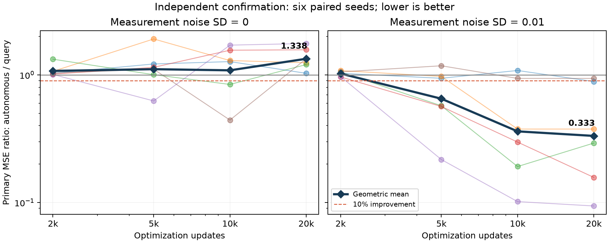

# 20,000 更新独立确认结果

24/24 个任务正常完成，共480,000次更新。调度作业23779927（准备/冒烟）和23779928（正式数组）全部COMPLETED、0:0。完整回收444个原始内容文件及清单，逐文件长度、SHA256和文件集合一致；264个保存的权重文件通过有限值检查，96个主端点独立CPU重放通过。

## 主结果

| 训练噪声标准差 | 自主模型主MSE | 请求时长模型主MSE | A/B几何平均 | 六seed A/B | 预设门槛 |
|---|---:|---:|---:|---|---|
| 0 | 1.04442e-6 | 7.80666e-7 | 1.33786 | 1.029 / 1.246 / 1.205 / 1.574 / 1.763 / 1.338 | 未通过 |
| .01 | 8.68526e-6 | 2.61014e-5 | .33275 | .887 / .377 / .292 / .157 / .094 / .939 | 通过 |

噪声组主MSE几何平均改善约66.7%，六seed全部方向改善、五seed达到10%改善。无噪声组六seed全部方向更差，汇总误差增加约33.8%。这支持限定噪声条件下的候选收益，反对普遍精度优势的叙述。

所有模型只用状态快照训练；相同已知扩散与负三次项，两种模型在同一seed内匹配样本、初值、测量噪声和优化预算。有效参数97/129、名义参数193；不是有效容量完全相等的对照。

## 预算轨迹

| 更新预算 | 无噪声A/B | 含噪声A/B | 定位 |
|---:|---:|---:|---|
| 2,000 | 1.07453 | 1.02455 | 次要诊断 |
| 5,000 | 1.10888 | .65093 | 次要诊断 |
| 10,000 | 1.08605 | .36116 | 次要诊断 |
| 20,000 | 1.33786 | .33275 | 预先固定的主预算 |

不能把先前三个种子的2,000次优势直接推广到独立六种子；本轮2,000次没有重复出该优势。噪声组的差异随优化预算增加而扩大，可能与对测量噪声的拟合和结构正则化有关，但本轮尚不能因果区分容量与时间条件化。

24个模型中14个满足15,000到20,000次最佳验证误差改善不足1%的平台诊断，另外10个仍明显改善。因此不能把整批称为充分收敛实验。种子同时改变训练数据与初始化，只有六个配对重复。

主指标是测试nu=.02、终点1.2/2.4、步长.06/.12的四项MSE几何平均，再跨seed几何平均。主模型由独立验证集选择；测试集没有参与选择。门槛为汇总A/B<=.90、至少4/6seed<=.90、没有seed>1.05，该门槛不是统计显著性检验。

原训练源码78f5e27cf3d2f1f4c6cc26b2955529d19c155c1c。原始回收包SHA256：1df584e053c1a629e3583676466241f87d3dbcf29b5c879c05b79c0962f21c57。

